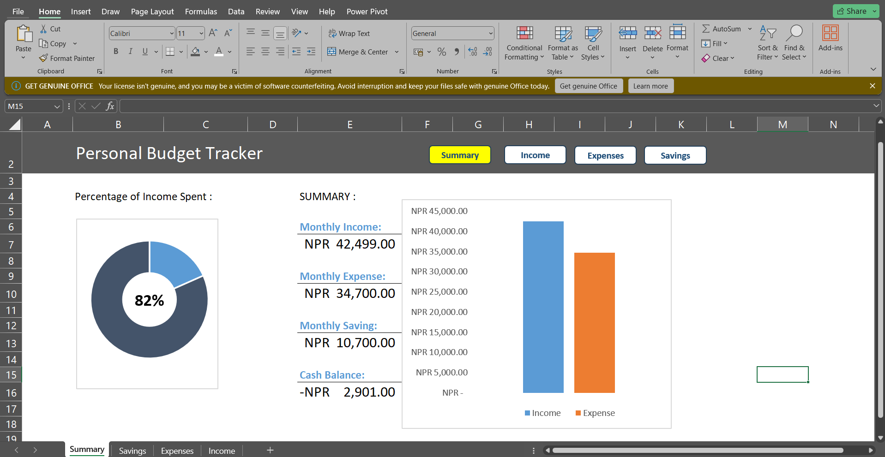

# 🚀 Exercise I: Embark on Your Data Science Journey with the Excel Personal Budget Tracker 📊

## Welcome Aboard!

Welcome, aspiring data scientist! Your journey begins with mastering the art of managing finances. The Excel Personal Budget Tracker is your trusty companion on this exciting adventure, designed to equip you with essential data skills while keeping your finances in check.

## Features That Set You on Course 🛠️

- **Interconnected Sheets**: Seamlessly navigate between Summary, Savings, Expenses, and Income sheets as you chart your financial odyssey.
- **Smart Data Entry**: Capture income sources, dates, and amounts, and monitor expenses and savings with ease.
- **Automated Calculations**: Let the magic of formulas handle the numbers, while you focus on your exploration.
- **Visual Insights**: Unravel the mysteries of your financial universe with dynamic bar charts and doughnut charts.
- **Track Spending Habits**: Navigate through the galaxies of spending habits with interactive charts.
- **Flexibility and Dynamism**: Like a spacecraft navigating through space debris, the tracker adapts to your needs, ensuring smooth sailing ahead.

## Embarkation Port: Screenshots from the Frontier 🚢

Behold the wonders that await you in the vast expanse of the Excel Personal Budget Tracker:

## Plotting Your Course: Navigation Instructions 🗺️

1. **Data Entry**: Set course for the Savings, Expenses, or Income sheets to input your financial coordinates.
2. **Automatic Calculation**: Witness the magic as the Summary sheet calculates your financial trajectory.
3. **Visualize Your Journey**: Immerse yourself in the stunning visuals of the bar charts and doughnut charts on the Summary sheet.
4. **Customization**: Tailor your journey by customizing categories and chart formatting to suit your unique path.
5. **Stay on Course**: Keep your ship steady and on course by maintaining your data in the structured tables.

Safe travels and may the data be with you! 
