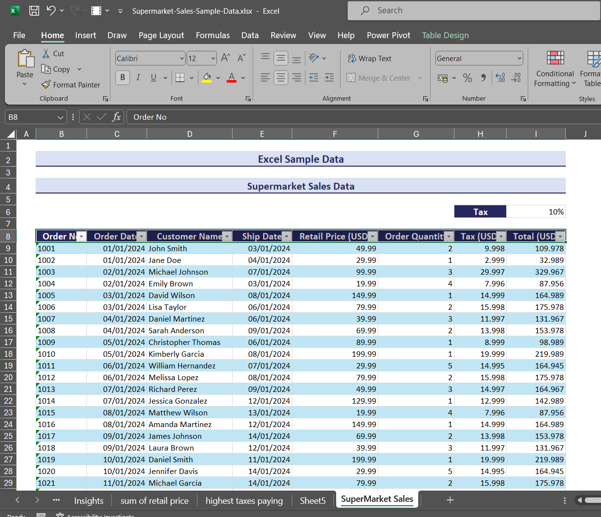
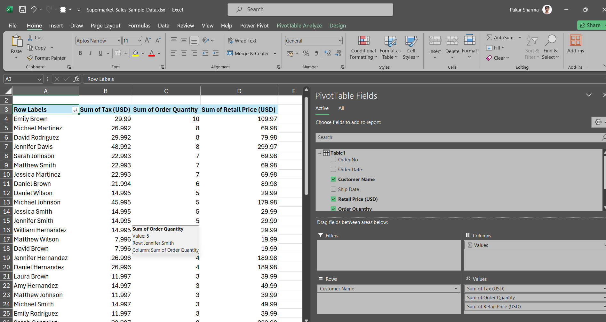

# Sales Data Insights Documentation

## Overview:
This document aims to provide insightful analysis based on the provided sales data. The data consists of various columns such as Order No, Order Date, Customer Name, Ship Date, Retail Price (USD), Order Quantity, Tax (USD), and Total (USD). Through careful examination, several key insights have been derived which can aid in understanding the sales trends, customer behavior, and financial performance.

## Data Filtering Technique:
Pivot tables were utilized to filter the sales data based on different parameters such as order date, customer name, and total sales amount. This facilitated a structured analysis of the data and enabled the extraction of meaningful insights.

## Insights:

1. **Highest Tax Paid:** 
   - Amount: $46.991
   - Date: 01/02/2024
   - On 1st February 2024, the highest tax amount of $46.991 was recorded. This indicates a significant transaction or a set of transactions that incurred considerable tax charges.

2. **Day with the Highest Sales:**
   - Sales Amount: $299.97
   - Date: 01/01/2024
   - The sales peaked on 1st January 2024, reaching $299.97. This suggests that this particular day witnessed a surge in purchasing activity, potentially due to various factors such as promotions, seasonality, or new product launches.

3. **Top 5 Customers with the Highest Order Count:**
   - **Emily Brown:** 10 orders
   - **Michael Martinez:** 8 orders
   - **David Rodriguez:** 8 orders
   - **Jennifer Davis:** 8 orders
   - **Sarah Johnson:** 7 orders
   - These customers have consistently placed a significant number of orders, indicating a strong relationship with the business and possibly high satisfaction levels with the products or services offered.

4. **Top 5 Customers with the Highest Sales Amount:**
   - **Jennifer Davis:** $538.912
   - **Michael Johnson:** $505.945
   - **David Wilson:** $472.967
   - **Jessica Wilson:** $395.967
   - **David Rodriguez:** $329.912
   - Jennifer Davis emerges as the top spender with a total purchase amount of $538.912, followed closely by Michael Johnson and David Wilson. These customers contribute substantially to the revenue generation of the business.

## Conclusion:
The provided sales data, filtered using pivot tables, offers valuable insights into the performance of the business, customer preferences, and revenue trends. By leveraging these insights, the company can strategize effectively to optimize sales, enhance customer relationships, and improve overall financial performance. Continuous monitoring and analysis of such data will be instrumental in driving future growth and success.

[Insert Screenshot Here]

