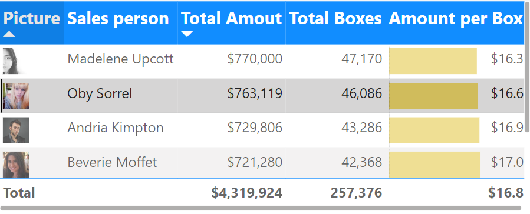
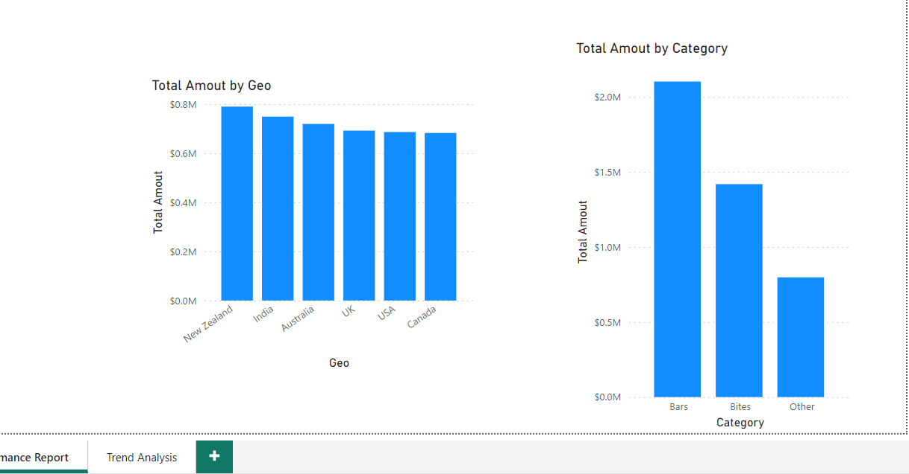
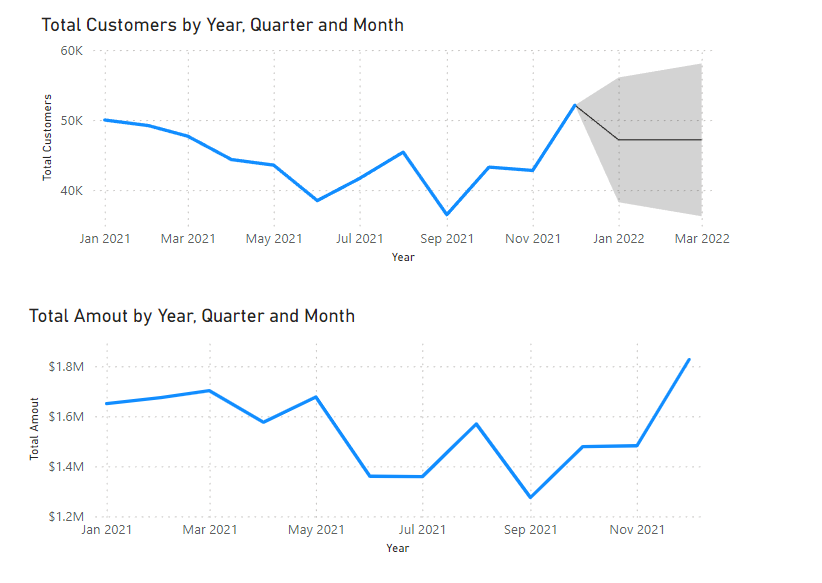

# 🚀 Exercise III: Explore Power BI Sales Dashboard 📊

## Welcome to Exercise III!

Welcome, data explorer! In Exercise III, you'll dive into the world of Power BI Sales Dashboard, where you'll analyze sales performance reports and trend analysis to uncover valuable insights. Get ready to harness the power of data visualization and make informed business decisions.

## Power BI Sales Dashboard: Sales Performance Report & Trend Analysis

Welcome to our interactive sales dashboard, designed to provide comprehensive insights into sales performance and trend analysis. This dashboard empowers you to make data-driven decisions by visualizing key metrics and trends.

## Sales Performance Report

### Picture Sales Person Amount Dashboard

- **Description**: Visualizes sales performance by displaying pictures of salespersons along with their sales amounts.
- **Features**:
  - Picture thumbnails of salespersons.
  - Sales amount achieved by each salesperson.
  - Interactive selection options for viewing individual salespersons or entire teams.
- **Usage**: Select individual salespersons or teams to analyze their sales performance.

### Total Amount by Geo and Total Amount by Category

- **Description**: Presents total sales amount breakdown by geographical region and product category.
- **Features**:
  - Interactive maps displaying sales amounts by geographical regions.
  - Bar charts showcasing total sales amounts by product categories.
- **Usage**: Analyze sales performance across different geographical regions and product categories.

## Trend Analysis

### Total Customers Trend Analysis

- **Description**: Forecasts total customers over time by year, quarter, and month.
- **Features**:
  - Line chart illustrating the trend in total customers.
  - Forecasting model to predict future customer trends.
- **Usage**: Identify customer growth patterns and anticipate future trends.

### Total Amount Trend Analysis

- **Description**: Analyzes total sales amount trends over time by year, quarter, and month.
- **Features**:
  - Line chart displaying sales amount trends.
  - Forecasting model to predict future sales amounts.
- **Usage**: Track sales performance trends and make informed business decisions.

## Instructions for Usage

1. **Sales Performance Report**: Navigate through different dashboards using interactive selection options.
2. **Trend Analysis**: Explore customer and sales amount trends over time using the trend analysis dashboards.
3. **Interactivity**: Utilize filtering and drill-down capabilities to dive deeper into specific data points.
4. **Forecasting**: Leverage forecasting models to predict future sales performance and customer trends.

## Support and Feedback

For any questions, feedback, or assistance with the Power BI Sales Dashboard, please contact our support team at [email address]. We value your input and are committed to improving your dashboard experience.

Happy analyzing and may your insights drive business success!
