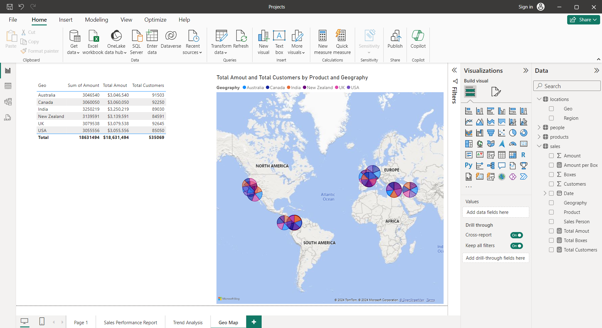

# Sales Distribution Mapping Documentation

## Introduction
This document guides you through the process of mapping sales distribution by reasons using the Power BI dashboard.

## Dashboard Overview
The dashboard provides a visual representation of sales data across different regions with the ability to filter and analyze based on various criteria.

## Data Preparation
Ensure your sales data includes a ‘Reason’ column.
Import the data into Power BI.

## Creating the Map Visualization
1. **Select the Map Visualization:** Choose the map visualization from the Visualizations pane.
2. **Add Data Fields:** Drag the ‘Reason’ field to the Legend area, and the ‘Sales Amount’ field to the Size area.
3. **Adjust Settings:** Customize the map settings to display the data according to your preferences.

## Analyzing the Data
- Use the map to identify patterns and trends in sales distribution by reasons.
- Apply filters to drill down into specific details.

## Exporting the Documentation
Once your analysis is complete, export the report to a markdown file by summarizing the steps and findings.

## Conclusion
The Power BI dashboard is a powerful tool for visualizing and analyzing sales distribution by reasons, providing valuable insights for strategic decision-making.
