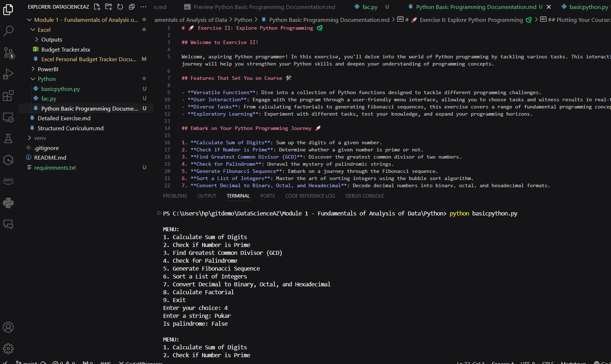

# 🚀 Exercise II: Explore Python Programming 🐍

## Welcome to Exercise II!

Welcome, aspiring Python programmer! In this exercise, you'll delve into the world of Python programming by tackling various tasks. This interactive journey will help you strengthen your Python skills and deepen your understanding of programming concepts.

## Features That Set You on Course 🛠️

- **Versatile Functions**: Dive into a collection of Python functions designed to tackle different programming challenges.
- **User Interaction**: Engage with the program through a user-friendly menu interface, allowing you to choose tasks and witness results in real-time.
- **Diverse Tasks**: From calculating factorials to generating Fibonacci sequences, this exercise covers a range of fundamental programming concepts.
- **Exploratory Learning**: Experiment with different tasks, test your knowledge, and expand your programming horizons.

## Embark on Your Python Programming Journey 🚀

1. **Calculate Sum of Digits**: Sum up the digits of a given number.
2. **Check if Number is Prime**: Determine whether a given number is prime or not.
3. **Find Greatest Common Divisor (GCD)**: Discover the greatest common divisor of two numbers.
4. **Check for Palindrome**: Unravel the mystery of palindromic strings.
5. **Generate Fibonacci Sequence**: Embark on a journey through the Fibonacci sequence.
6. **Sort a List of Integers**: Master the art of sorting integers using the bubble sort algorithm.
7. **Convert Decimal to Binary, Octal, and Hexadecimal**: Decode decimal numbers into binary, octal, and hexadecimal formats.
8. **Calculate Factorial**: Venture into the realm of factorials and explore their fascinating properties.
9. **Exit**: Conclude your Python exploration and return to your base camp.

## Screenshot

## Plotting Your Course: Navigation Instructions 🗺️

1. Select a task from the menu by entering the corresponding number.
2. Follow the prompts to input any required parameters.
3. Observe the program's output, which will provide the result or perform the specified action.
4. Repeat the process to explore additional tasks and deepen your Python proficiency.

Happy coding and may your Python adventures be fruitful!
