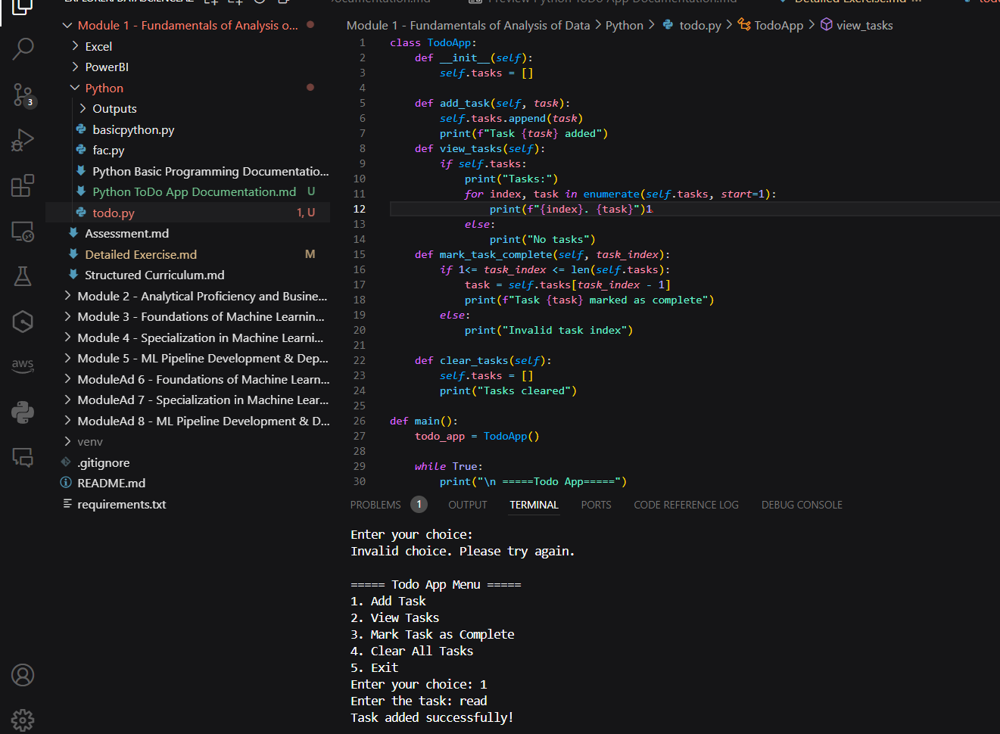

# Todo App Documentation

## Overview:
This documentation describes a simple to-do list application implemented in Python. The application allows users to add tasks, view existing tasks, mark tasks as complete, clear all tasks, and exit the program.

## `TodoApp` Class:
The `TodoApp` class encapsulates the functionality of the to-do list application. It includes the following methods:

### `__init__(self)`
- Initializes the `TodoApp` object with an empty list of tasks.

### `add_task(self, task)`
- Adds a new task to the list of tasks.
- **Parameters:**
  - `task`: The task to be added.
- **Output:**
  - Prints a message confirming the addition of the task.

### `view_tasks(self)`
- Displays all tasks currently in the list.
- **Output:**
  - Prints a numbered list of tasks if tasks exist.
  - Prints "No tasks" if the list is empty.

### `mark_task_complete(self, task_index)`
- Marks a task as complete based on its index in the list.
- **Parameters:**
  - `task_index`: The index of the task to mark as complete.
- **Output:**
  - Prints a message confirming the task marked as complete.
  - Prints "Invalid task index" if the provided index is out of range.

### `clear_tasks(self)`
- Clears all tasks from the list.
- **Output:**
  - Prints a message confirming that all tasks have been cleared.

## `main()` Function:
The `main()` function serves as the entry point of the program. It creates an instance of the `TodoApp` class and presents a menu to the user, allowing them to interact with the to-do list.

### Menu Options:
- **Add task:** Prompts the user to enter a new task and adds it to the list.
- **View tasks:** Displays all tasks currently in the list.
- **Mark task as complete:** Allows the user to mark a task as complete by specifying its index.
- **Clear tasks:** Clears all tasks from the list.
- **Exit:** Exits the program.

## Running the Program:
To run the program, execute the Python script. Follow the on-screen instructions to interact with the to-do list.

## Screenshot and Output:
